## AWS Essentials

https://learning.oreilly.com/videos/amazon-web-services/9780134702186/9780134702186-awsa_01_01

### 1.1 Cloud Computing
On-demand
Resource pooling (shared servers, shared buildings)
Rapid Elasticity => growing when we need to grow
Measured service => Pay as you go

### 1.2 Regions
Primary building block.
VM, Storage, ... You pick a region.
Cost in AWS is determined by the region.
You can choose multiple regions (for multiple audiences), or also to spread risk

### 1.3 Availability zones

Availability zones are a collection of datacenters. Connected with private fiber.
us-west-2a us-west-2b us-west-2c ...
They are key to fault tolerance.
System that's resilient on the machine, but also resilient on the datacenter.
What happens when a datacenter becomes unreachable.

### 1.4 Edge locations
Edge location
Caching
Amazon route 53 => DNS query as quickly as possible.
Edge location serve Amazon CloudFront and they serve Amazon route 53

### 1.5 Scope of services

#### Global

AWS IAM
AWS CloudFront
AWS Route53

#### Regional
Dynamo DB ...

#### Availability
Elastic block store
Elastic compute cloud

### 1.6 Service overview
AWS console.
top right => choose region.

Compute, Storage, Database, Networking, Analytics, Security, Management Tools, Developer tools, Internet of Things, Game development, Mobile services, ...
Rich environment.

## 2. Security in AWS
### 2.1 AWS Identity and Access Management
AWS IAM
Authent Autho Users Group, Password Policy, Multi factor authentication => Smth you know combined with smth you have (phone (have), user/password (know))
Authenticating and Authorizing against AWS API.

### Creating a user and group

#### Create a User
autogenerate a password AND require to create a new password at next sign in
give the password to the person over an encrypted connection of some kind.

#### Create a group

Create a group, create permissions, and add user to the group

### 2.3 access keys

jane.doe
password.
She wants sdk, CLI, ... Create Access Key for Jane.doe.
Access ID, Secret Accesss key.

### Permissions and Policies
Permissions are granted via policies
Policies are written in JSON

We can genetare policies thanks to a tool created by Amazon.

All policies start with a default implicit deny.

We need an explicit allow to have permissions.
Amazon Resource Name :
Fromat pattern to find in the docs.
arn:aws:iam:...:user/jdoe
arn:aws:s3:
arn:aws:
smth can be let blank :::::

implicit deny => explicit deny => explicit allow

Statements specify :
Principal (resource based policies)
Actions

- ex2:RunInstanced
  Resources
- EC2 instances
  Conditions
- time of day
- from specific IP address
- resource contains particular tag

### 2.5 Creating and attaching policies

Generator creates the appropriate syntax.
Allow
EC2
RunIntances, ... (actions that are authorized).
ARN : \* (all)

And then you can attach a policy to a group.
Developers => run EC2 instances.

### 2.6 Understanding Roles

Rotate credentials regularly.
Credentials should never be shared, in the code or in environment variables
Roles enable us to use temporary credentials that are cached by the cli or the sdk.
high level of security

### 2.7 Creating roles

IAM => Role section
create new role
Role Name => Name of application. myApplication
Role type (S3 stuff)
attach policy

every application will be able to read from S3

### 2.8 Federated Users

We can create Single Sign on
LDAP, Active directory.

We can federate applications so that they can all use the same S3 bucket.
This way we can bypass backend APIs. Allow mobile apps to access directly s3 services.

User authenticate against our app
Identity broker will make a acall to aws security token service.
The service will return temporary credentials.

C'est pour gérer les devs je crois (?)

### 2.9 managing an MFA device

Multi factor authentication
Hardware MFA device (to be ordered from Amazon :o )
Virtual MFA device
QR code or show secret key.
Scan.
Add authentication code
wait
add second authentication code

have jane come over to my desk.

in case you can't call jane to you desk

### 2.10 Resource Policies

Apply permission to aws permissions.
policies that are not applied to users or group, but to resources.
Make an s3 bucket publicly readable for example.

### 2.11 Applying resource policy

S3 service
add bucket policy
click policy generator
allow
getObject, listObjects ....
arn:aws:s3:::nameofthebucket/\*

add statement

### 2.12 Using roles for cross account access

Payer Account (initial account)
(pays the bill)

Development account - Production Account

you can **leverage** roles.
You can allow a user in one account to access ressources from another account.

### 2.13 Best Practices

Leverage groups : give only ENOUGH rights. Not more.

- Grant least privilege
- Strong pwd policy
- deny statements for added security
- never share credentials
- multiple accounts for isolation

master account

- protect it
- don't use for day-to-day
- delete default access keys
- Enable MFA with physical key, and lock in a safe.

## Networking AWS

Amazon virtual private cloud : VPC
Segment networks
Create a VPC in a particular region.
Choose a particular address range
We can create subnets.

### 3.2 Creating a VPC

from the aws console
VPCs are specific to a region
We have a default VPC from Amazon.
10.2.0.0 => the widest range of ip addresses

a vpc has a route table
ACL => Allow incoming or outcoming traffic

### 3.3 adding subnets

Create a subnet below a VPC, and specify an availability zone
We can assign a CIDR block (I really have to learn more about CIDR ranges !!)
/24 => allows 256 IP addresses. The 1st 4, and the last one IP address are not usable (used by AWS)

### 3.4 Routing

ELB => load balancer
EC2 application server
Database
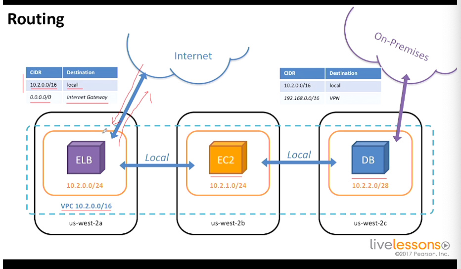
Route tables that enable to hide EC2 and database from the internet.
On premises network (what's that ?)

### 3.5 demo
Routing subnets to the internet.
vpc dashboard => route table

Route tables associated
create internet gateway
attach internet gateway to vpc

auto-assign public IP
=> do that to enable EC2 instances

### 3.6 public private and hybrid subnets

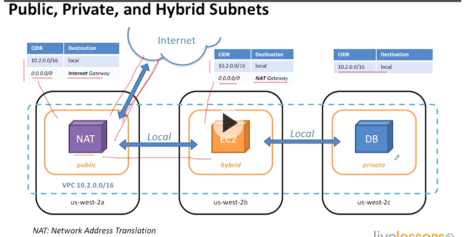

### 3.7 Network Access Control Lists

tool to use within VPC that are stateless
like a firewall arround a subnet

### 3.8 Security Groups
firewall that applies to an EC2 instance.
it is Stateful.

### 3.9 creating an NACL

web traffic acl
associated to vpc

inbound =>
rule #100 HTTP 80 TCP 80 0.0.0.0/0 ALLOW
rule #101 HTTPs 443 TCP 80 0.0.0.0/0 ALLOW

outbound =>
rule #100 TCP 1080-65535 ALLOW (send to the internet)

### 3.10 Creating a security group

web-server
web application security
inbound rules accept http and https from anywhere
NACL => subnet can receive traffic
Security group => Instance can receive traffic
so this is not double work

### 3.11 VPC peering

It is a way to pair 2 VPCs.
IP ranges must not overlap
Peering connection PCX
routing traffic from one range to another range

### 3.15 Aws direct connect
dedicated private connection
1Gbps or 10 Gbps options.

## 4 Computing in AWS

### 4.1 EC2

Elastic compute cloud (EC2)
Virtual machine
based on Xen hypervisor
Various combinations of cpu, memory, disk, IO
one VM called an instance

### 4.2 AMazon Machine Image

bit for bit copy of root volume
you launch a machine from a machine image

### 4.3 Launching a linux instance

Amazon images
Amazon Linux
64 bits
.ebs => Elastic block

t2 micro
auto assign public IP
tag instance to keep your environment organized
Name : Linux-demo
Environment : dev
Application : xxx

security group !!!

download a private keypair to to access the instance
public IP and private IP are associated to that instance
add security group to give shell access
go back to the instance, change security groups, add ssh security group
port 22 in ssh should be opened

ssh -i azez.pem ex2-user@public.ip.of.instance

### 4.4 Key pairs

public and private keys.
Way of login into the operating system.
2048 ssh2 rsa keypairs

### 4.5 Instance metadata service

retrieve information about an EC2 instance
service within an instance to get information about itself
use this instance with scripts to bootstrap stuff.
The script gets information about the instance to configure software.

169,254,169,254/latest/meta-data

### 4.6 Demo instance Metadata Service

curl http://169.254.169.254/latest/meta-data
get the instance id :
export instanceId= curl http://169.254.169.254/latest/meta-data/instance-id
shell scripts that could access that variable.

### 4.7 bootstraping with userdata

it's the key to maintain a self healing environment

### 4.8 Launching a windows instance

Meh windows

### 4.9 Stopping and terminating instances

Stop => can restart later
terminate => throw away

### 4.10 Billing options

on demand vs reserved instances
availability is not guaranteed on reserved instances

reserved instance have a commitment (1 year, 1 or 3 year)

### 4.11 highly available web application

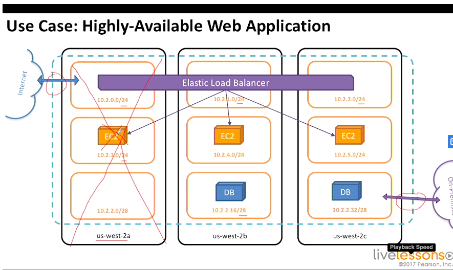

3 tier architecture in amazon ec2

### 4.12 => 4.14 Introduction to AWS Lambda

Mobile Application could access Amazon Simple Storage Service.
Amazon cognito => Federated user retrieves temporary credentials

upload directly to S3.
Fire event to lambda function.
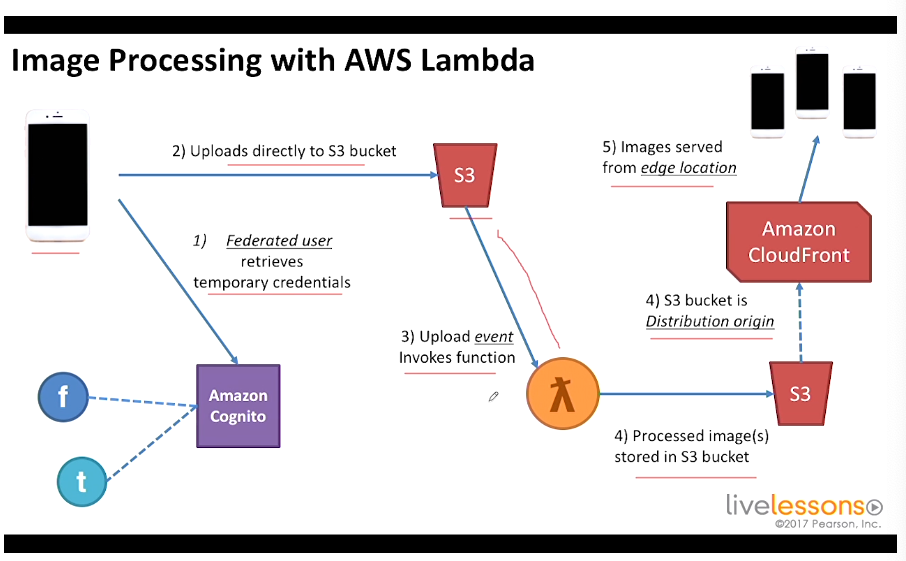

highly available and fault tolerant
Speed time to market

## 5. Storage options

### 5.1 overview of aws storage options

EC2 => Instance store
block storage that are built in to the EC2 instance
storage there is EPHEMERAL.
cannot take snapshots
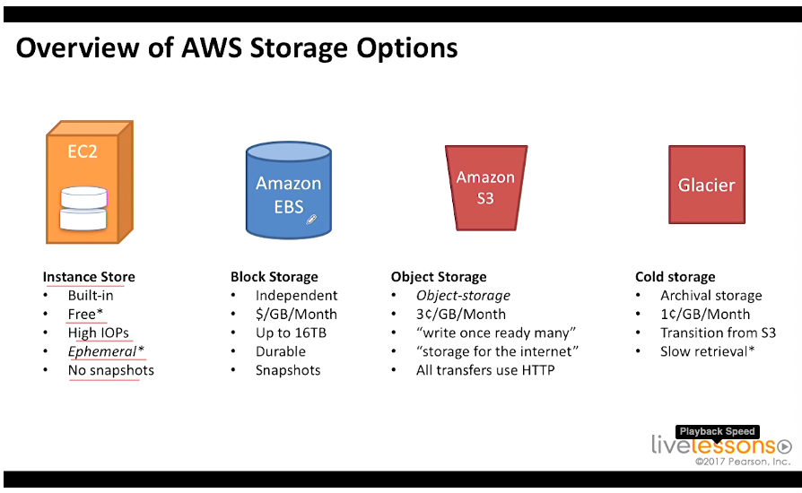

EBS => not resilient to the loss of a data center.
Independant
Snapshots
pay per gb per month

Amazon S3
write once, read many
storage for the internet
for things that need to be retrieved from users

AWS Storage gateway
virtual machine that is designed to be run on-premises
it exposes a device

### 5.2 Amazon simple storage service

object storage.
highly available and fault tolerant.
no filesystem
Bucket => Object
upload limit of 5 gb
objects can be multi part up to 5 TB

object storage vs block storage

### 5.3 Demo creating buckets and object

host static website on s3 :o :o :o

### 5.4 Bucket Security with resource policies

### 5.5 Introduction to Amazon Glacier

Write once, read rarely
glacier is cold storage
3-5 hours to get the files

### 5.7 Demo: Adding life cycle Rules

### 5.8 Instance Store Volumes

they are build-in and ephemeral

### 5.9 Elastic block stock EBS

it is not a NAS
pay for provisioned storage
data is independent from instance, and is connected over network
can detach and attach to another

### 5.11 Creating an EBS volume in the aws dashboard

volume type (HDD, SSD)

## 6. Databases

### 6.1 Options

Amazon RDS => for sql stuff, mariadb
Amazon ElastiCache => Memcached, redis
DynamoDB => NoSQL, Event-driven.
Redshift => Encryption

### 6.2 Amazon RDS
Snapshots, backups and patches
Read replicas for when we have read heavy traffic

### 6.3 Data Durability
Multi AZ deployments
Primary instance with secondary standby in a different availability zone

### 6.4 Launch an Amazon RDS instance

subnet group => several subnets
publicly accessible => NO

### 6.5 Amazon DynamoDB

NoSQL Data store
easy noSQL service
Partition vs primary key

### 6.7 Scan and query operations

interface pour faire des query
https://learning.oreilly.com/videos/amazon-web-services/9780134702186/9780134702186-awsa_06_07

### 6.8 Amazon ElastiCache

Redis => in memory database, backed to disk
Memcached => in memory key-value store, not backed to disk

### 6.9 Amazon redshift

SQL compliant.
It is a clustered service
parallel queries across the nodes.
Ideal for OLAP and BI apps
pedabyte scale data wharehouse

### 6.10 database for e-commerce

Elastic load balancer => 3 EC 2 instances

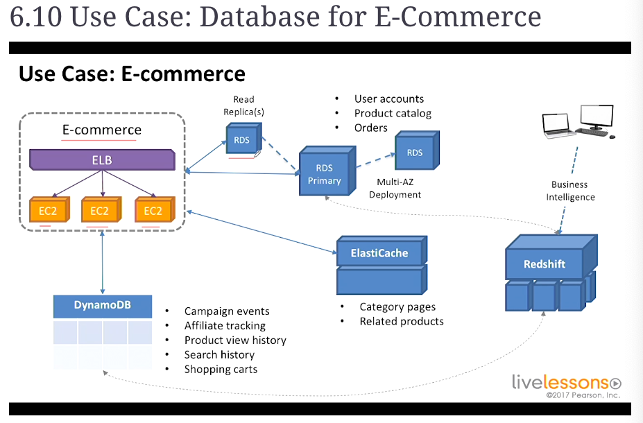

Read replica(s)
Multi-AZ => Amazon handles the primary and secondary thing

ElastiCache => Category pages, related products

copies to redshift in order to run BI stuff
use redshift to understand conversion rates

## 7 Analytics in AWS

### 7.1 Real time stream processing => Amazon Kinesis

"SOAP" and old school technologies from back in the 90s.
Use case : warn users of the lifecycle of a pizza before it is delivered to them.

Kinesis

### 7.2 Real time stream processing

It divides large amount of data into usable shards.
(terabytes per hour)

1 shard => 1000 PUTs per second

Kinesis stream should be handled by Apps that have ONE SINGLE PURPOSE
It can be Aggregation, Sliding Window analysis,

### 7.3 Big data with amazon elastic MapReduce
yet another "amazing" service.

Managed Hadoop framework (or spark, presto, hbase)
provision single or thousands of instance.

for data intensive applications.
Data mining, log analysis, scientific simulation, genomics.
can read data from anywhere.

### 7.4 AWS Data Pipeline

Transform data from one data type to another datatype.
Helps move data between data sources.
It uses EC2 or EMR to transform Data.
Can Execute SQL queries, or custom applications.

### 7.5 Video Subscription Service Business Intelligence

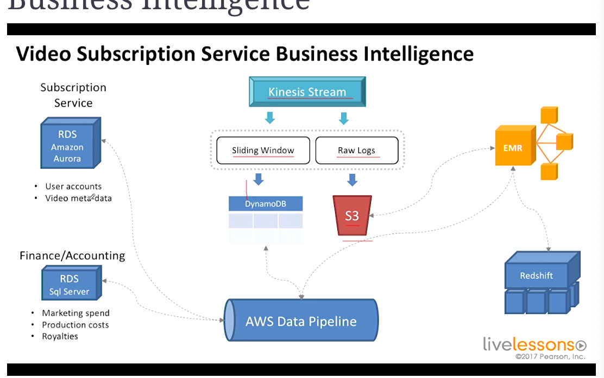

### 8 Developer and management tools

### 8.1 CloudWatch

Collect metrics on amazon stuff.
It stores metrics for up to 2 weeks
each service (EC2, ELB, EBS) will get its collection of metrics.

\$/metric

Application-level metrics, or intance-level metrics.

CPU CloudWatch Alarms.
Triggered on breach of threshold.
Alarm CPUUtilization is over 80% for 2 periods of 1 minute for example

Doesn't necessarily signal emergency.

can publish notifications.
Up to 5000 alarms per account.

### 8.2 CloudWatch Logs
Search using specific syntax (see docs)
Can search JSON fields
Subscription filters

### 8.3 Cloudformation Infrastructure as code
Infrastructure as code
cloud formation templates
architectures are complex
Manual process => bad documentation, difficult to reproduce
Challenges with scripts => Dependencies

Solution : Automate with CloudFormation

Templates are meant to be written once and be deployed many times
Parameters,

### 8.4 Cloudformation demo

designer within cloudformation to create templates.

### Application Deployment and management

AWS Elastic BeanStalk
Application management platform
easy entry
Ideal for developers.
Super convenient Beanstalk handle resources automatically

AWS OpsWorks
Configuration management platform
supports chef recipes (configuration as code)
based on chef recipes
OpsWorks ideal for DevOps Engineers.

### Launching an application on aws beanstalk

example

## 9. Mobile Application and services

### 9.1 Amazon Simple Queue service

Highly Available and fault tolerant.
Seems like RabbitMQ
Buffering events to enable loose coupling and asynchronous management

### 9.2 Amazon Simple Notification Service SNS

publish/subscribe

### 9.3 Amazon simple email service SES

Sending bulk email at scale
Transactional emails, marketing emails, social networking
get feedback about those who have been bounced, those who are marked as spam ...

### 9.4 Amazon Cognito
Identity
Integrates with major authentication providers.
Enable SSO or login with social media
Cognito can stor app data, state, preferences.
Can store in local with SQLite.

### 9.5 Amazon Mobile Analytics
Makes it easy to measure usage of application.
What are the going on trends?
integrate AWS mobile SDK
Also offers REST API.

## 10. High availability and fault tolerence
### 10.1 Elastic Load Balancing
What happens when this component fails ?
Spread instances across availability zones

### 10.2 Listeners and SSL Certificates
Use the amazon certificate manager to have HTTPS !!
Free

Upload the certificate to IAM, and then choose it for HTTPs listener

### 10.3 Load Balancing
Maintaining balance between availability zones

### 10.4 Creating an ELB
EC2 => load balancers
define vps and listeners
add security groups. The load balancer should have his own security group.
Configure Health Check
add EC2 Instances (they must be in the vpc we have chosen
)

### 10.5 auto scaling
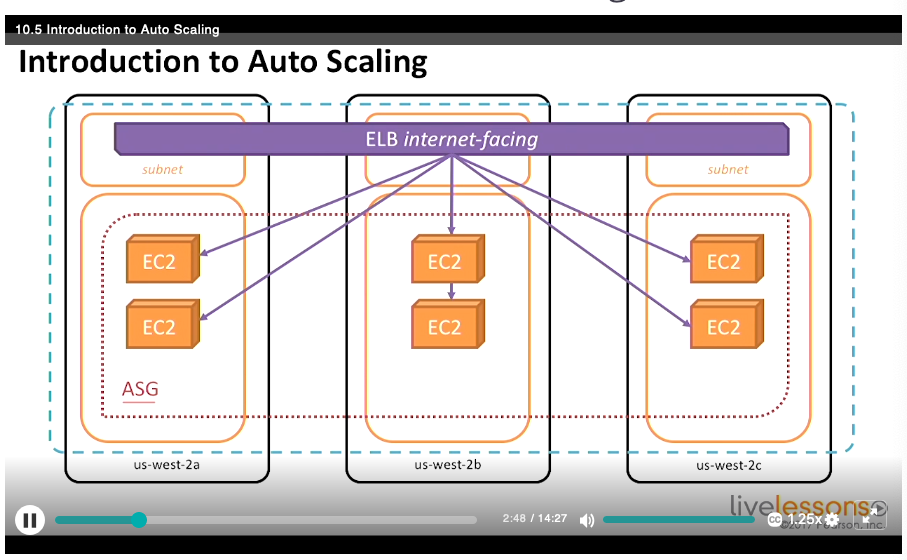
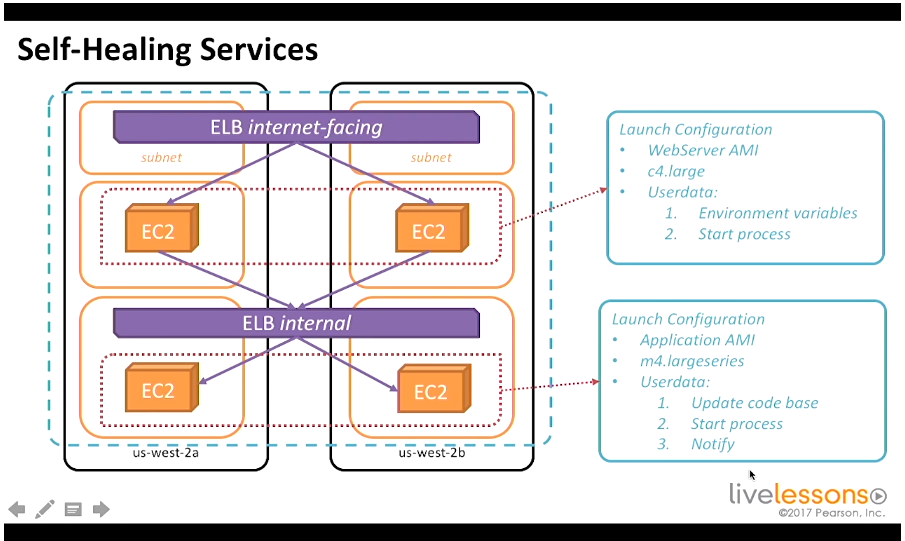
self healing services

### 10.6 Demand based Scaling
Scale to meet the demand.
AutoScaling groups along with Amazon CloudWatch alarms.
Scale down when CPU is low.
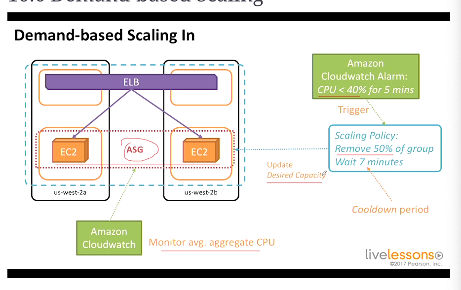

### 10.7 Creating an auto scaling group
1. create a launch configuration
yum install -y httpd
to be added in create launch configuration
2. Create auto scaling group
select the right vpc
configure scaling policies

## 11 Course Wrap up
### 11.1 The ideal
- Highly available
it is up a great majority of the time
AMI, EC2, S3, Auto Scaling

- fault-tolerant
Aplpication continues to operate through fault
AMI (?), EC2, Elastic Load Balancing

- Secure
AWS CLI/Console

- Durable
Data survives loss of infrastructure
EBS, Snapshots, S3, Glacier

### 11.2 Best Practices
- Design for Failure
  - Everything will fail eventually
  - any component can fail at any time
  - "What happens when "____" ?

- Scale Horizontally
  - Stateless Applications/Components (state should not be stored locally)
  - ElastiCache, DynamoDB
  - Distributed processsing :
    - parallelize and batch
    - Kinesis, Elastic Map Reduce

- Disposable resources over fixed servers
- Automate, automate, automate !
  - CloudFormation
  - Elastic Beanstalk
  - AutoScaling
  - CloudWatch
  - Third Party Tools
    - Ansible, chef, puppet as ways to automate environment

- Security in Layers
  - VPS, Routes, NACLs, Security groups
  - IAM: Users, groups (least rights possible), roles, keys
  - Leverage multiple accounts
  - Protect Master credentials

- Loose Coupling
  - Microservices
  - Failures should not cascade
  - ELB, Amazon SQS, Kinesis ...

- Optimize for cost

### 11.3 The exam
80 minutes
55 questions
Architect a solution that is technically appropriate, and cost effective.
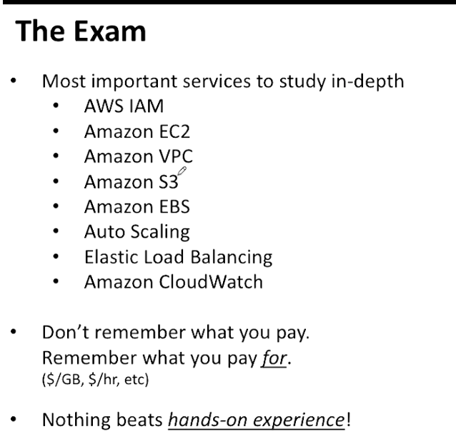
