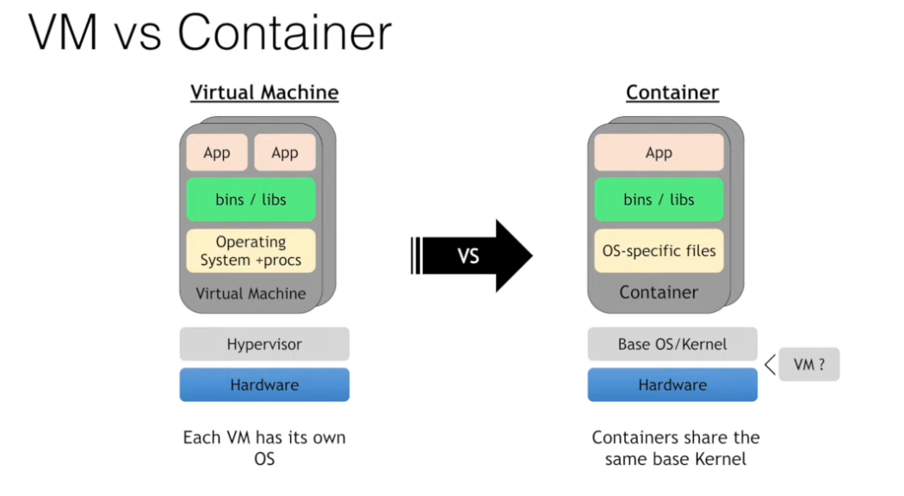
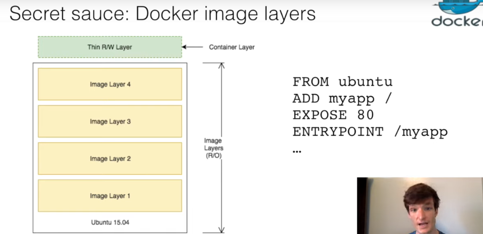
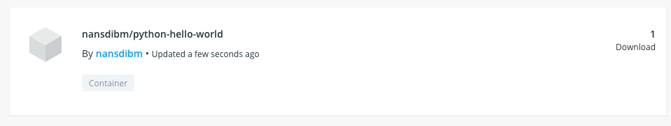
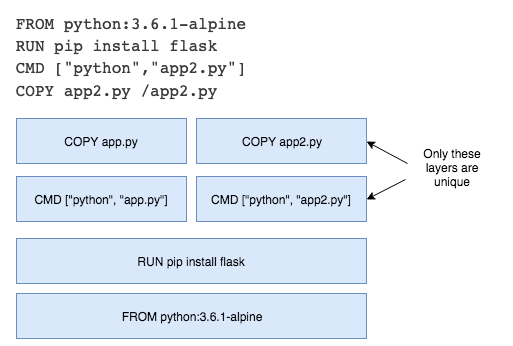
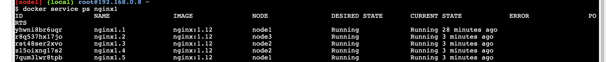
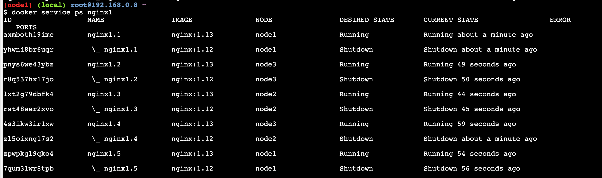
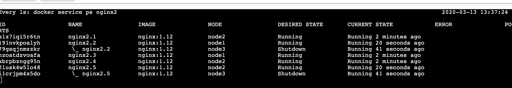
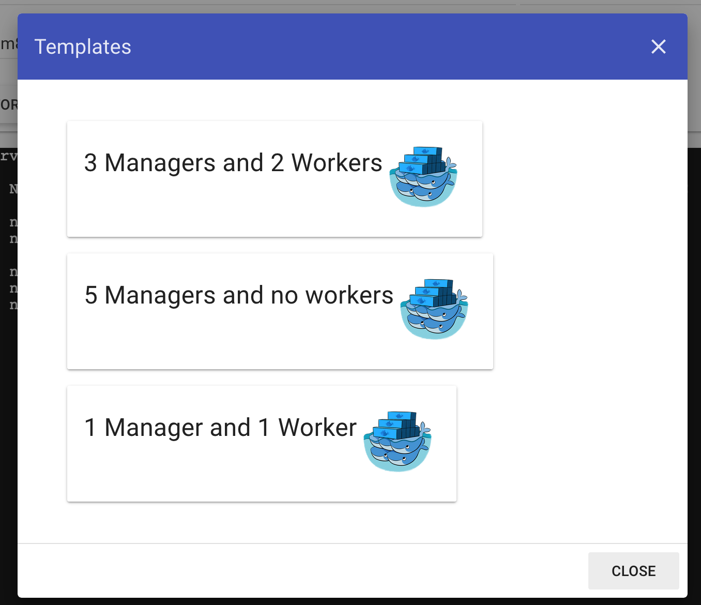

# Docker Essentials: A developer introduction
## Lab 1 : Running a container
### What are Containers ?
A group of precesses, run in isolation. They run on a shared kernel.
The isolation is provided by Linux **namespaces**.

VM vs Container
VMs are heavy and slow to start because they have a full OS.

containers can be directly run on top of virtual machines.

### What is Docker ?
Docker is tooling to manage containers.
*"build once, run anywhere"*

### Why containers are appealing
- no more "Works on my machine"
- lightweight and fast
- better resource utilization

### Running a container
```bash
docker container run -t ubuntu top
```

The docker run command first starts a docker pull to download the Ubuntu image onto your host. After it is downloaded, it will start the container. 

Even though we are using the Ubuntu image, it is important to note that the container does not have its own kernel. It uses the kernel of the host and the Ubuntu image is used only to provide the file system and tools available on an Ubuntu system.

```bash
docker container ls
CONTAINER ID        IMAGE               COMMAND             CREATED             STATUS              PORTS               NAMES

        ubuntu              "top"               58 seconds ago      Up 58 seconds                           wizardly_germain
```

then
```bash
$ docker container exec -it 7d1a9d47e601 bash
root@7d1a9d47e601:/#
```
 Using docker container exec with bash is a common way to inspect a Docker container.

 > Namespaces are a feature of the Linux kernel. However, Docker allows you to run containers on Windows and Mac. The secret is that embedded in the Docker product is a Linux subsystem.

 ### 2. Run multiple containers
 running an nginx server :
```bash
docker container run --detach --publish 8080:80 --name nginx nginx
```

`--detach` flag will run this container in the background.
the `publish` flag publishes port 80 in the container by using port 8080 on your host.

So here, go to localhost:8080 :


The `name` flag names the container.

Then, we can run another container :
```bash
docker container run --detach --publish 8081:27017 --name mongo mongo:3.4
```

We can see the containers by running `docker container ls`.

### Removing containers
1. Stop the containers :
```bash
docker container stop <container-id>
```
2. Remove the stopped containers : 
```bash
docker system prune
```

⚠️ Note :
You should avoid using unverified content from the Docker Store when developing your own images because these images might contain security vulnerabilities or possibly even malicious software.


## Lab 2 Add CI/CD value with Docker images
### Docker images
- Docker image is a tar file containing a container's filesystem + metadata
- for sharing and redistribution

**Docker registry** push and pull image from registry.
Default registry: Docker hub. Public and free for public images.

You can also have a private registry, self-hosted, or cloud provider options.

Creating a docker image - with Docker build
- Create a "Dockerfile"
  - It contains a List of instructions for how to construct the container
- `docker build -f Dockerfile`

Secret Sauce: Docker image layers



to make pushes faster, the lines in the docker file that change the most should be at the bottom of the file.
Because when you invalidate a layer, you automatically invalidate the layers after it.
So if it is the last layer, we optimize the caching system.

- union file system
  - merge image layers into single file system for each container
- copy-on-write
  - copies files that are edited up to top writable layer

  Lab objectives : 
  - create custom image using a Dockerfile, 
  - build and run your image locally
  - push your image to your account on DockerHub
  - Update your image with a code change to see Docker image layering/caching in action

### Create a python app
Paste this in a file called app.py to create a simple Flask app :
```python
from flask import Flask

app = Flask(__name__)

@app.route("/")
def hello():
    return "hello world!"

if __name__ == "__main__":
    app.run(host="0.0.0.0")
```

then run 
```bash
pip3 install flask
python3 app.py
```

### Creating and building the docker image
Create a file named Dockerfile and add the following content:
```
FROM python:3.6.1-alpine
RUN pip install flask
CMD ["python","app.py"]
COPY app.py /app.py
```

The FROM line specifies the starting image to build your layers on top of it.
 In this case, you are selecting the `python:3.6.1-alpine` base layer because it already has the version of Python and pip that you need to run your application.
 he alpine version means that it uses the alpine distribution, which is significantly smaller than an alternative flavor of Linux. A smaller image means it will download (deploy) much faster.

 > It is best practice to use a specific tag when inheriting a parent image so that changes to the parent dependency are controlled. If no tag is specified, the latest tag takes effect, which acts as a dynamic pointer that points to the latest version of an image.

 For security reasons, you must understand the layers that you build your docker image on top of.

 The RUN command executes commands needed to set up your image for your application, such as installing packages, editing files, or changing file permissions. In this case, you are installing Flask. The RUN commands are executed at build time and are added to the layers of your image.

 CMD is the command that is executed when you start a container. Here, you are using CMD to run your Python application.
 There can be only one CMD per Dockerfile. If you specify more than one CMD, then the last CMD will take effect.

 This line copies the app.py file in the local directory (where you will run docker image build) into a new layer of the image.

 It seems counter-intuitive to put this line after the CMD ["python","app.py"] line. Remember, the CMD line is executed only when the container is started, so you won't get a file not found error here.

For full specifications about the Dockerfile :[documentation here](https://docs.docker.com/engine/reference/builder/).


Then, we can **build the Docker image**.
```bash
docker image build -t python-hello-world ./
```
The `-t` parameter allows us to name the image.

then we can run 
```bash
docker image ls
```
to see our image !

### Run the docker image

```bash
docker run -p 5001:5000 -d python-hello-world
```

it returns > `0a8fa98d3b930c7b2d986c76fdeaf6b86cf041343be804a33585ccc9aedf5958`

Navigate to http://localhost:5001 => you see "hello world!".


To see the logs :
```bash
docker container logs 0a8fa98d3b930c7b2d986c76fdeaf6b86cf041343be804a33585ccc9aedf5958
```
It returns :
```
 * Serving Flask app "app" (lazy loading)
 * Environment: production
   WARNING: This is a development server. Do not use it in a production deployment.
   Use a production WSGI server instead.
 * Debug mode: off
 * Running on http://0.0.0.0:5000/ (Press CTRL+C to quit)
172.17.0.1 - - [13/Mar/2020 09:10:34] "GET / HTTP/1.1" 200 -
172.17.0.1 - - [13/Mar/2020 09:10:34] "GET /favicon.ico HTTP/1.1" 404 -
```

> The Dockerfile is used to create reproducible builds for your application. A common workflow is to have your CI/CD automation run docker image build as part of its build process. After images are built, they will be sent to a central registry where they can be accessed by all environments (such as a test environment) that need to run instances of that application. In the next section, you will push your custom image to the public Docker registry, which is the Docker Hub, where it can be consumed by other developers and operators.

### Push to a central registry

Login to the docker registry :
```bash
docker login
````

Tag the image with you username.
The Docker Hub naming convention is to tag your image with `[dockerhub username]/[image name]`. 

```bash
docker tag python-hello-world nansdibm/python-hello-world
```

Use docker push :
```bash
docker push nansdibm/python-hello-world
```

You can see your image on docker hub in the browser.



### Deploy a change
Update app.py by changing "Hello World" with "Hello Beautiful World!".

Rebuild the image
```
docker image build -t nansdibm/python-hello-world .
```

Notice the "Using cache" for Steps 1 - 3. These layers of the Docker image have already been built, and the docker image build command will use these layers from the cache instead of rebuilding them.

```bash
docker push nansdibm/python-hello-world
```

```
The push refers to repository [docker.io/nansdibm/python-hello-world]
bd3dadabc6d3: Pushed 
455874a92037: Layer already exists 
5f354b8b5dc0: Layer already exists 
f61107386c17: Layer already exists 
db49993833a0: Layer already exists 
58c71ea40fb0: Layer already exists 
2b0fb280b60d: Layer already exists 
```
There is a caching mechanism in place for pushing layers too. Docker Hub already has all but one of the layers from an earlier push, so it only pushes the one layer that has changed.

### Understanding image layers
```
FROM python:3.6.1-alpine
RUN pip install flask
CMD ["python","app.py"]
COPY app.py /app.py
```

Each of these lines is a layer. Each layer contains only the delta, or changes from the layers before it. To put these layers together into a single running container, Docker uses the union file system to overlay layers transparently into a single view.

The "copy-on-write" function is very fast and in almost all cases, does not have a noticeable effect on performance. You can inspect which files have been pulled up to the container level with the docker diff command. For more information, see the command-line reference on the docker diff command.

```bash
docker diff 0a8fa98d3b93
```

Because image layers are read-only, **they can be shared by images and by running containers**.



> Because the containers use the same read-only layers, you can imagine that starting containers is very fast and has a very low footprint on the host.

### Remove the containers
```bash
docker container ls
```

```bash
docker container stop 0a8fa98d3b93
```

```bash
docker system prune
```

## Lab 3 Orchestrate applications with Docker Swarm

### Container orchestration
What about production ?
Automated scheduling and scaling, zero downtime deployments, high availability and fault tolerance...

What is container orchestration ?
- Cluster management
- Scheduling
- Service discovery
- Health management
- Declare desired state
  - Active reconciliation

Docker swarm, Kubernetes, ...
With hosted solutions :
- IBM Cloud Container Services
- Amazon ECS
- Azure Containers
- Google ...

Setup a 3 node cluster with container orchestration with Docker Swarm.
- Schedule and scale an application
- Expose the application
- Update with a rolling update
- Demonstrate node failure and reconciliation

### Create your first swarm
Using https://labs.play-with-docker.com/ 
Create a new instance

```bash
docker swarm init --advertise-addr eth0
```

To add a worker in this swarm :
```bash
docker swarm join --token SWMTKN-1-61p9nb8opn3tg8lchklkbyjz7uhysj8krjexrlaxpr3kaprte8-ex2t37ry9f8ux0xu92u3jfsm8 192.168.0.8:2377
```

To add a manager :
```bash
docker swarm join-token manager
```

> You can think of Docker Swarm as a special mode that is activated by the command: docker swarm init. The --advertise-addr option specifies the address in which the other nodes will use to join the swarm.

With other instances, you can join the swarm by running 
```bash
docker swarm join --token SWMTKN-1-61p9nb8opn3tg8lchklkbyjz7uhysj8krjexrlaxpr3kaprte8-ex2t37ry9f8ux0xu92u3jfsm8 192.168.0.8:2377
```

Back on node1, run 
```bash
docker node ls
```

### Deploy your first service
To run containers on a Docker Swarm, you need to create a service. A service is an abstraction that represents multiple containers of the same image deployed across a distributed cluster.

> The --mount flag is useful to have NGINX print out the hostname of the node it's running on. You will use this later in this lab when you start load balancing between multiple containers of NGINX that are distributed across different nodes in the cluster and you want to see which node in the swarm is serving the request.

```bash
docker service ls
```

```bash
docker service ps nginx1
```

### Scale your service
Update your service with an updated number of replicas.
```bash
docker service update --replicas=5 --detach=true nginx1
nginx1
```
- The state of the service is updated to 5 replicas, which is stored in the swarm's internal storage.
- Docker Swarm recognizes that the number of replicas that is scheduled now does not match the declared state of 5.
- Docker Swarm schedules 4 more tasks (containers) in an attempt to meet the declared state for the service.

```bash
docker service ps nginx1
````



```bash
docker service logs nginx1
```

### Apply rolling updates

```bash
docker service update --image nginx:1.13 --detach=true nginx1
```



### Reconcile problems with containers
```bash
docker swarm leave
```



### Determine how many nodes you need
For a production application, you should provision a cluster with multiple manager nodes to allow for manager node failiures.
At least 3 manager nodes, but no more than 7. 
- 3 manager nodes tolerate 1 node failure
- 5 manager nodes tolerate 2 node failures
- 7 manager nodes tolerate 3 node failures

Play with docker Templates :


### Summary
- Docker Swarm schedules services by using a declarative language. You declare the state, and the swarm attempts to maintain and reconcile to make sure the actual state equals the desired state.
- Docker Swarm is composed of manager and worker nodes. Only managers can maintain the state of the swarm and accept commands to modify it. Workers have high scalability and are only used to run containers. By default, managers can also run containers.
- The routing mesh built into Docker Swarm means that any port that is published at the service level will be exposed on every node in the swarm. Requests to a published service port will be automatically routed to a container of the service that is running in the swarm.

