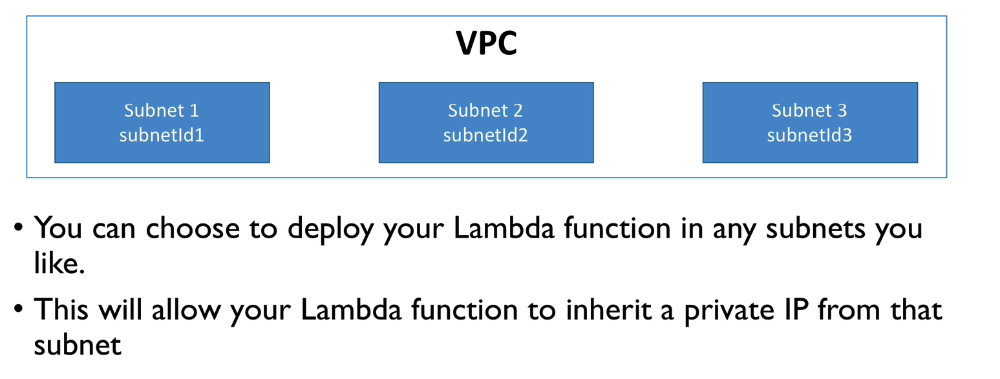
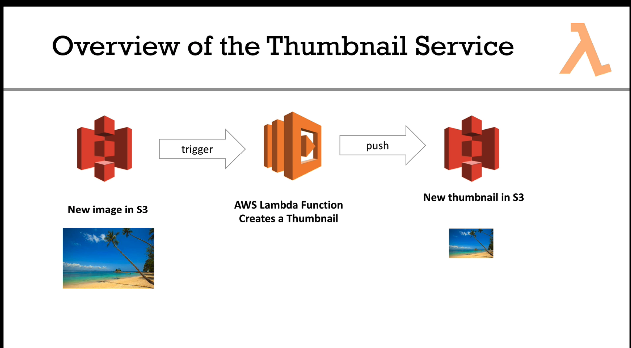
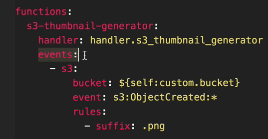
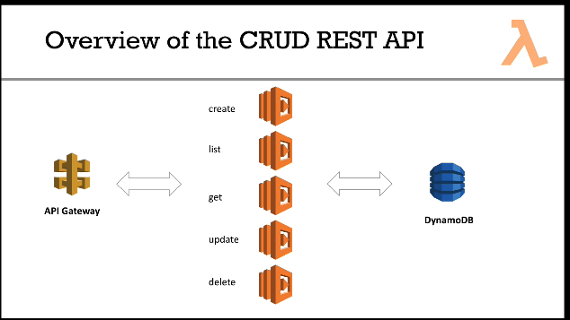
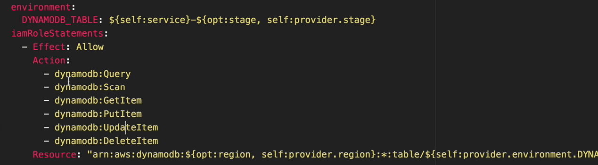
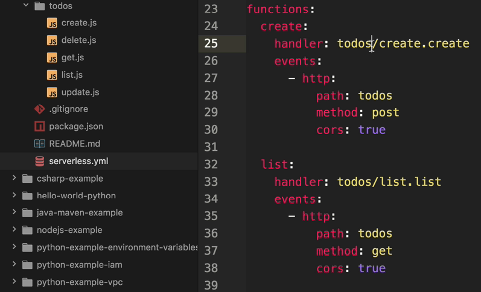
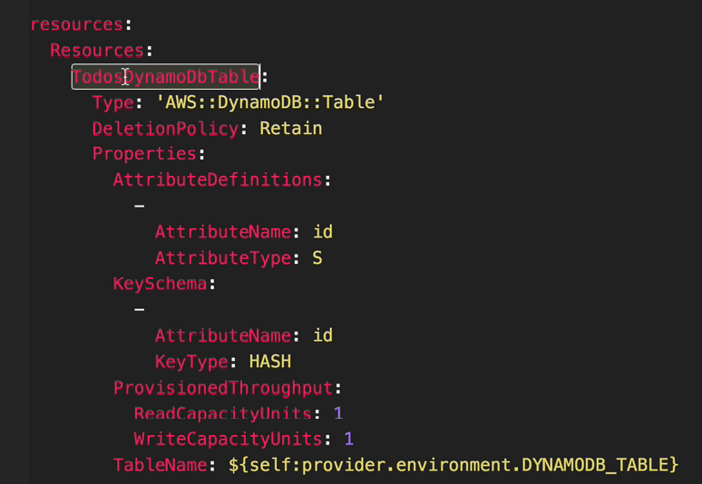
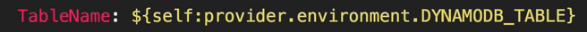
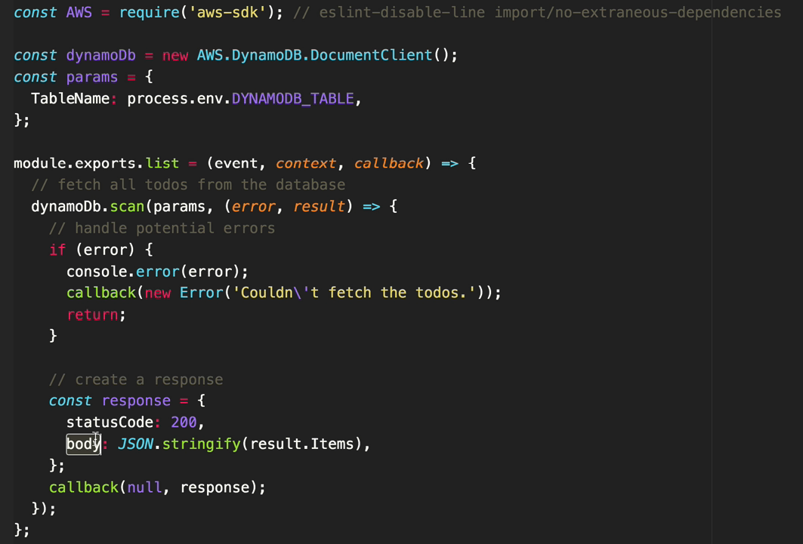

# Learn AWS Lambda and see real world example with serverless

main documentation : https://serverless.com/ 

## What is lambda
functions
limited by time
run on demand
scaling is automated -> that's why we call it "Serverless"

## Pricing
- pay per request
- pay per compute time

## AWS Lambda integrations
- API Gateway -> to build a REST API
- Kinesis -> processing data in streams
- DynamoDB -> Managed NoSQL database
- ...

## Example : Thumbnail creation
"Database Trigger-like" behavior for S3
New image in S3 -> trigger -> AWS Lambda function creates a thumbnail and push it to S3

/!\ the handler is the name of function that will be called in lambda
The instructor only did a "hello world".

## The Serverless Framework
Aims to ease the pain of creating, deploying, managing and debugging lambda functions.
Integrates with CI/CD tools.
CloudFormation support (templates for deploying).

```bash
npm install -g serverless
```

IAM => Create a serverless-admin (new user). Programmatic access, and give administrator access. (not best practice though ...)

```bash
serverless config credentials --provider aws --key XXX --secret YYY --profile serverless-admin
```

## Hello world using the Serverless framework
`serverless` or `sls` => list of commands.

```
sls create --template aws-python --path hello-world-python
```

serverless.yml add
```yml
profile: serverless-admin
region: eu-west-3
```

```bash
sls deploy -v
```

the code is uploaded to s3, and then CloudFront is configured. IAM role is created for us.

## Running a function from the command line
```bash
sls invoke -f hello -l
```

## Updating the function
change the `print` statement.
```bash
sls deploy function -f hello
```
=> how to integrate that with a proper CI/CD system ?

## Fetching function logs
```bash
sls logs -f hello -t
```

enables to stream function logs as they happen !

## Remove the function
```bash
sls remove
```

## add an IAM role statement to a function
```yaml
iamRoleStatements:
  - Effect: "Allow"
    Action:
    - "lambda"
    Resource:
    - "*"
```
## VPC for lambda functions
can launch a lambda in a VPC so that they can access EC2 instances or RDS instances.

can specify securityGroupIds and subnetsId in the serverless.yml file.

## Real world example : Service to create S3 image thumbnails



- S3 events
- plugins to deploy python dependencies (docker needed)

Triggering a function from an s3 event :


plugin : 
serverless-python-requirements
it installs what's written in requirements.txt file.
Pillow => import PIL

## Real world example : REST API with API Gateway and DynamoDB



Lambda functions are stateless, they don't keep anything in memory, so they will write to DynamoDB.

package.json => like requirements.txt

```yaml
environment : 
  DYNAMODB_TABLE: ${self:service}-${opt:stage, self:provider.stage}
```





POST on /todos => call create function
this is wired to the API gateway

under resources, you can specify the cloud formation template





response should always have a statusCode and a body.



## Personal investigation : creating a full stack app
If you want to build an app that can leverage that rest API that is written in Lambda, you can use aws-amplify : https://aws-amplify.github.io/docs/js/api.


