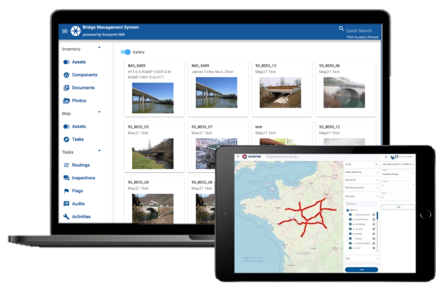

## Beyond Asset

([source](https://www.sixense-group.com/en/offer/platform-solutions/beyond-asset))

### What is it about ? 👷‍♀️
Beyond Asset is an asset management solution that manages and optimises
the condition and maintenance of any infrastructure.

### My participation in this project:
- Technical dependencies management
- Fullstack development (Angular, Node, MongoDB)
- CI/CD
- General troubleshooting

[More info](https://www.sixense-group.com/en/offer/platform-solutions/beyond-asset)
