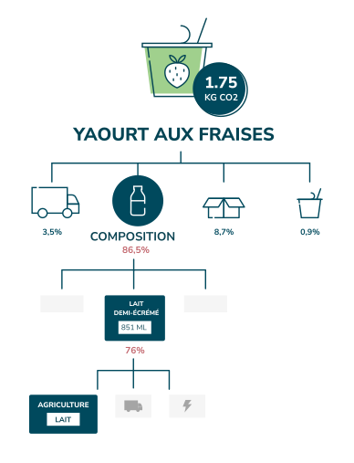

## Karbon Editor

### What is it about ? 🌱
A web application that enables people from the food industry
to understand the environmental impact caused by their activity.
This is a collaborative tool that aims at making eco-designing food products easier.

### My participation in this project:
- Fullstack development (React, Node, GraphQL, Typescript)
- Hiring, onboarding, training and coaching of team members
- Project management
- Management of UI/UX freelance workers
- CI/CD

[More info](https://karbon.earth)
