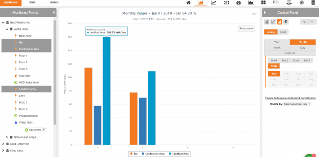

## Wattics Dashboard

  

### What is it about ? ⚡
Enterprise Energy Management Software for Smart Meters, Sensors. A user friendly dashboard to monitor energy consumption, and extract meaningful information out of tons of data.

### My participation in this project:

- Fullstack development (Ruby on Rails, JavaScript, React) with features such as white labeling, costs calculation, localization, ...
- UI redesign
- Automatic testing

[More info](https://www.wattics.com/)
